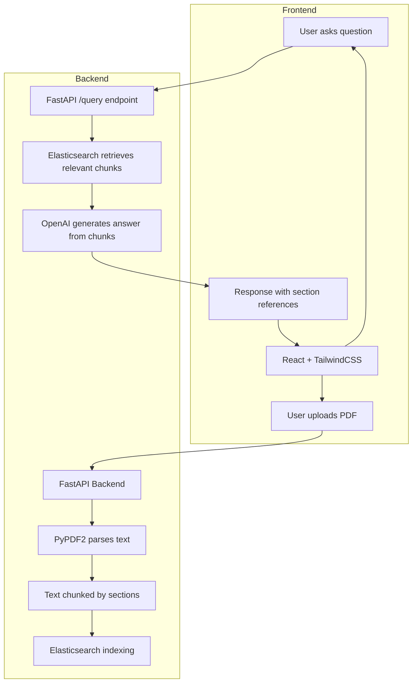

# LawBandit

AI legal document analyzer. Upload a PDF of any legal document (contract, lease, NDA, terms of service) and ask questions about it in plain English. The backend parses the document, indexes it with Elasticsearch, and uses OpenAI to generate answers with references to specific sections.

I built this because reading legal documents is painful and most people just sign without understanding what they're agreeing to.

## architecture



## how it works

1. Drop a PDF into the upload area
2. Backend extracts text using PyPDF2, splits it into chunks by section
3. Chunks get indexed in Elasticsearch with metadata (page number, section)
4. Ask a question like "what happens if I break the lease early"
5. Elasticsearch finds the most relevant chunks
6. OpenAI reads those chunks and generates a plain English answer
7. Answer includes references to which section/page the info came from

## stack

Frontend: React, TailwindCSS
Backend: FastAPI, Python
Search: Elasticsearch
AI: OpenAI API
PDF parsing: PyPDF2

## run it

Backend:
```
cd backend
pip install -r requirements.txt
uvicorn main:app --reload
```

Frontend:
```
cd frontend
npm install
npm run dev
```

You need Elasticsearch running locally and an OpenAI API key in your .env file.
